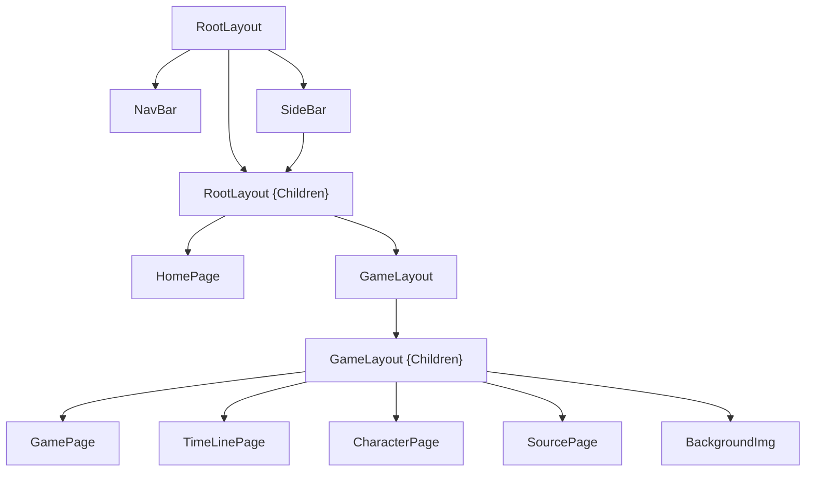

# Game Guides NextJS

## Content
* [Page Structure](#page-structure)
* [Environment](#environment)
* [Images](#images)
* [Passing Props to a Component](#passing-props-to-a-component)
* [Client Toggle](#client-toggle)
* [Google Auth](#google-auth)

## Dependencies
```
// nextjs tailwindcss
npm install daisyui
npm install next-auth
```

# Page Structure

```
/
├── src/
│   ├── app/
│   │   ├── api/
│   │   │   └── auth/
│   │   │       └── [...nextauth].ts
│   │   ├── game/
│   │   │   └── [id]/
│   │   │       ├── character/
│   │   │       │   └── page.tsx
│   │   │       ├── source/
│   │   │       │   └── page.tsx
│   │   │       ├── timeline/
│   │   │       │   └── page.tsx
│   │   │       ├── layout.tsx
│   │   │       └── page.tsx
│   │   ├── globals.css
│   │   ├── layout.tsx
│   │   ├── loading.tsx
│   │   └── page.tsx
│   ├── components/
│   │       └── ...tsx
│   └── services/
│           ├── models.tsx
│           └── fetching.tsx // or singleton.tsx
├── .env.local
├── next.config.ts
└── tailwind.config.ts
```

# Environment
* Create the .env.local file at the root of your project (..env.local.demo)
```
API_GET_GAMES=
API_GET_IMG=
API_KEY=

NEXTAUTH_URL=
NEXTAUTH_SECRET=

GOOGLE_ID=
GOOGLE_SECRET=
```

# Images
* Config image domine in next.config.ts
```
images: {
  remotePatterns: [
    {
      protocol: 'https',
      hostname: 'my.url.net',
      pathname: '/api/img/**',
    },
  ],
},
```

# Passing Props to a Component
```
interface RootLayoutProps {
  children: React.ReactNode
}

export default async function RootLayout({ children }: RootLayoutProps) {
  const apiResult = await Singleton.getApiResultAsync()
  return (
    <>
      <SideBar games={apiResult.data}/>
      {children}
    </>
  );
}
```
```
interface SideBarProps {
  games: Game[]
}

export default async function SideBar({ games }: SideBarProps) {
  console.log(games)

  return (
    <div>Hola</div>  
  )
}
```

# Client Toggle
```
export default function BtnPokemon() {
  const [menu, setMenu] = useState(false)

  const handleClick = async () => {
    const sideBar = document.querySelector("#id_sidebar")
    setMenu(!menu)

    if (menu){
      sideBar?.classList.remove("hidden")
    } else {
      sideBar?.classList.add("hidden")
    }
  }

  return (
    <button onClick={ handleClick } className='bg-base-100/
    </button>
  )
}
```

# Google Auth
* [Google Console](https://console.cloud.google.com/apis)
* [Google oAuth2](https://developers.google.com/identity/openid-connect/openid-connect)
* [NextJS Auth](https://next-auth.js.org/providers/google)
* [NextJS Auth Example](https://next-auth.js.org/getting-started/example)

### Config next.config.ts
```
const nextConfig: NextConfig = {
  images: {
    remotePatterns: [
      {
        protocol: 'https',
        hostname: 'lh3.googleusercontent.com',
        port: '',
        pathname: '/a/**',
      },
    ],
  },
};
```
### Config .env.local
* NEXTAUTH_URL: use develop or production url
* NEXTAUTH_SECRET: add random token [Generate Plus](https://generate.plus/en/base64)
* GOOGLE_ID: add google id from [Google Credentials](https://console.cloud.google.com/apis/credentials?inv=1&invt=AboJbQ&project=nextauth13)
* GOOGLE_SECRET: add google secret from [Google Credentials](https://console.cloud.google.com/apis/credentials?inv=1&invt=AboJbQ&project=nextauth13)
```
NEXTAUTH_URL=http://localhost:3000
NEXTAUTH_SECRET=
GOOGLE_ID=
GOOGLE_SECRET=
```
### Google Credentials
* Create Google Credentials
* Add Develop url and Production url
* Add Auth Redirection
* Copy Google ID and Google Secret
```
// url 1
http://localhost:3000
// url 2
https://my.uri.app
```
```
// url 1
http://localhost:3000/api/auth/callback/google
// url 2
https://my.uri.app/api/auth/callback/google
```
### Create Route for AuthOptions
* src/services/authOptions.tsx
```
import { NextAuthOptions } from "next-auth";
import GoogleProvider from "next-auth/providers/google";

export const authOptions: NextAuthOptions = {
  providers: [
    GoogleProvider({
      clientId: process.env.GOOGLE_ID as string,
      clientSecret: process.env.GOOGLE_SECRET as string
    }),
  ],
  callbacks: {
    async session({ session, token }) {
      console.log('token', token);
      console.log('session', session);
      
      return session
    },
  },
}
```
### Create Route for Auth
* src/app/api/auth/[...nextauth]/route.tsx
```
import { authOptions } from "@/services/authOptions"
import NextAuth from "next-auth"

const handler = NextAuth(authOptions)
export { handler as GET, handler as POST }
```
### Create Context for Session
* src/services/SessionProviderContext.tsx
```
"use client"
import { SessionProvider } from "next-auth/react";

export default function SessionProviderContext({ children }: { children: React.ReactNode }) {
  return (
    <SessionProvider>
      { children }
    </SessionProvider>
  )
}
```
### Implementation
```
interface RootLayoutProps {
  {children: React.ReactNode}
}

export default async function RootLayout({ children }: RootLayoutProps) {

  return (
    <SessionProviderContext>
      { children }
    </SessionProviderContext>
  )
}
```
```
'use client'
import { signIn, signOut, useSession } from "next-auth/react";

export default function BtnAuth() {
  const auth = useSession()
  const user = auth.data?.user

  const login = async () => {
    await signIn("google", { callbackUrl: "/" })
  }

  const logout = async () => {
    await signOut({ callbackUrl: "/" })
  }
  
  return (
    user ? 
      <button onClick={logout}>LogIn</button>
    :
      <button onClick={login}>Logout</button>
  )
}
```

<hr>
<hr>
<hr>

This is a [Next.js](https://nextjs.org) project bootstrapped with [`create-next-app`](https://nextjs.org/docs/app/api-reference/cli/create-next-app).

## Getting Started

First, run the development server:

```bash
npm run dev
# or
yarn dev
# or
pnpm dev
# or
bun dev
```

Open [http://localhost:3000](http://localhost:3000) with your browser to see the result.

You can start editing the page by modifying `app/page.tsx`. The page auto-updates as you edit the file.

This project uses [`next/font`](https://nextjs.org/docs/app/building-your-application/optimizing/fonts) to automatically optimize and load [Geist](https://vercel.com/font), a new font family for Vercel.

## Learn More

To learn more about Next.js, take a look at the following resources:

- [Next.js Documentation](https://nextjs.org/docs) - learn about Next.js features and API.
- [Learn Next.js](https://nextjs.org/learn) - an interactive Next.js tutorial.

You can check out [the Next.js GitHub repository](https://github.com/vercel/next.js) - your feedback and contributions are welcome!

## Deploy on Vercel

The easiest way to deploy your Next.js app is to use the [Vercel Platform](https://vercel.com/new?utm_medium=default-template&filter=next.js&utm_source=create-next-app&utm_campaign=create-next-app-readme) from the creators of Next.js.

Check out our [Next.js deployment documentation](https://nextjs.org/docs/app/building-your-application/deploying) for more details.
