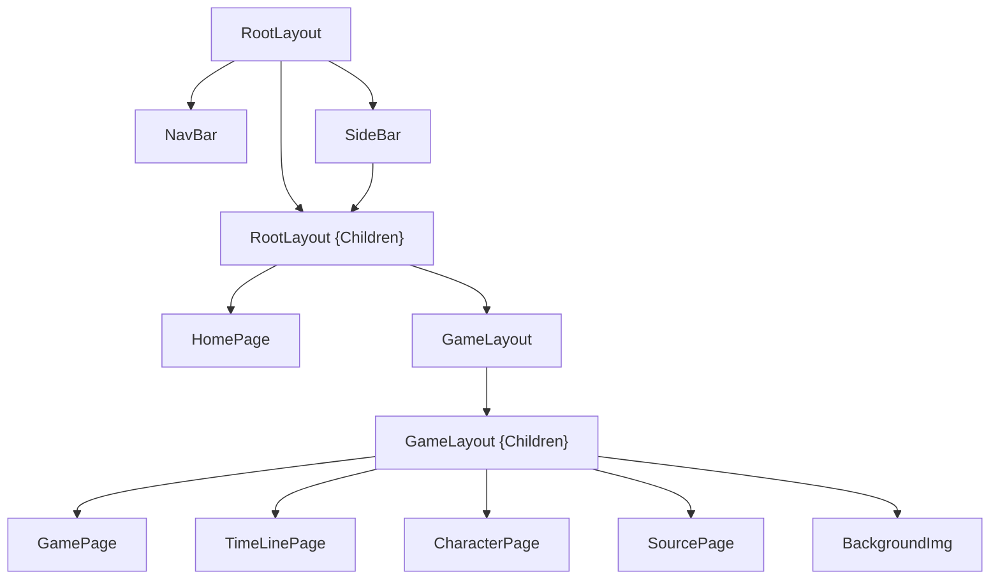

# Game Guides NextJS

## Page Structure

```
/
├── src/
│   ├── app/
│   │   ├── game/
│   │   │   └── [id]/
│   │   │       ├── character/
│   │   │       │   └── page.tsx
│   │   │       ├── source/
│   │   │       │   └── page.tsx
│   │   │       ├── timeline/
│   │   │       │   └── page.tsx
│   │   │       ├── layout.tsx
│   │   │       └── page.tsx
│   │   ├── globals.css
│   │   ├── layout.tsx
│   │   ├── loading.tsx
│   │   └── page.tsx
│   ├── components/
│   │       └── ...tsx
│   └── services/
│           ├── models.tsx
│           └── fetching.tsx // or singleton.tsx
├── .env.local
├── next.config.ts
└── tailwind.config.ts
```

# Environment
* Create the .env.local file at the root of your project
```
API_GET_GAMES=api_uri
API_GET_IMG=api_img_uri
```

# Images
* Config image domine in next.config.ts
```
images: {
  remotePatterns: [
    {
      protocol: 'https',
      hostname: 'my.url.net',
      pathname: '/api/img/**',
    },
  ],
},
```

# Passing Props to a Component
```
interface RootLayoutProps {
  children: React.ReactNode
}

export default async function RootLayout({ children }: RootLayoutProps) {
  const apiResult = await Singleton.getApiResultAsync()
  return (
    <>
      <SideBar games={apiResult.data}/>
      {children}
    </>
  );
}
```
```
interface SideBarProps {
  games: Game[]
}

export default async function SideBar({ games }: SideBarProps) {
  console.log(games)

  return (
    <div>Hola</div>  
  )
}
```

# Client Toggle
```
export default function BtnPokemon() {
  const [menu, setMenu] = useState(false)

  const handleClick = async () => {
    const sideBar = document.querySelector("#id_sidebar")
    setMenu(!menu)

    if (menu){
      sideBar?.classList.remove("hidden")
    } else {
      sideBar?.classList.add("hidden")
    }
  }

  return (
    <button onClick={ handleClick } className='bg-base-100/
    </button>
  )
}
```

<hr>
<hr>
<hr>

This is a [Next.js](https://nextjs.org) project bootstrapped with [`create-next-app`](https://nextjs.org/docs/app/api-reference/cli/create-next-app).

## Getting Started

First, run the development server:

```bash
npm run dev
# or
yarn dev
# or
pnpm dev
# or
bun dev
```

Open [http://localhost:3000](http://localhost:3000) with your browser to see the result.

You can start editing the page by modifying `app/page.tsx`. The page auto-updates as you edit the file.

This project uses [`next/font`](https://nextjs.org/docs/app/building-your-application/optimizing/fonts) to automatically optimize and load [Geist](https://vercel.com/font), a new font family for Vercel.

## Learn More

To learn more about Next.js, take a look at the following resources:

- [Next.js Documentation](https://nextjs.org/docs) - learn about Next.js features and API.
- [Learn Next.js](https://nextjs.org/learn) - an interactive Next.js tutorial.

You can check out [the Next.js GitHub repository](https://github.com/vercel/next.js) - your feedback and contributions are welcome!

## Deploy on Vercel

The easiest way to deploy your Next.js app is to use the [Vercel Platform](https://vercel.com/new?utm_medium=default-template&filter=next.js&utm_source=create-next-app&utm_campaign=create-next-app-readme) from the creators of Next.js.

Check out our [Next.js deployment documentation](https://nextjs.org/docs/app/building-your-application/deploying) for more details.
